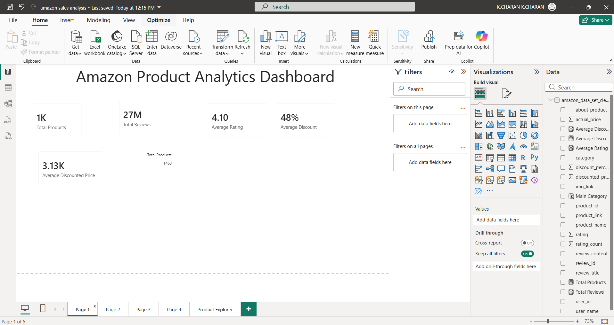
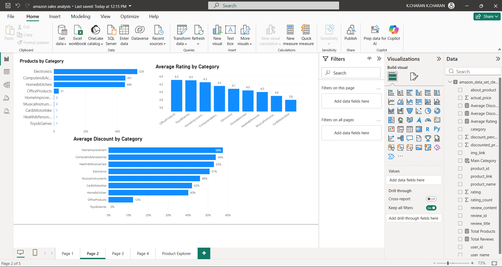
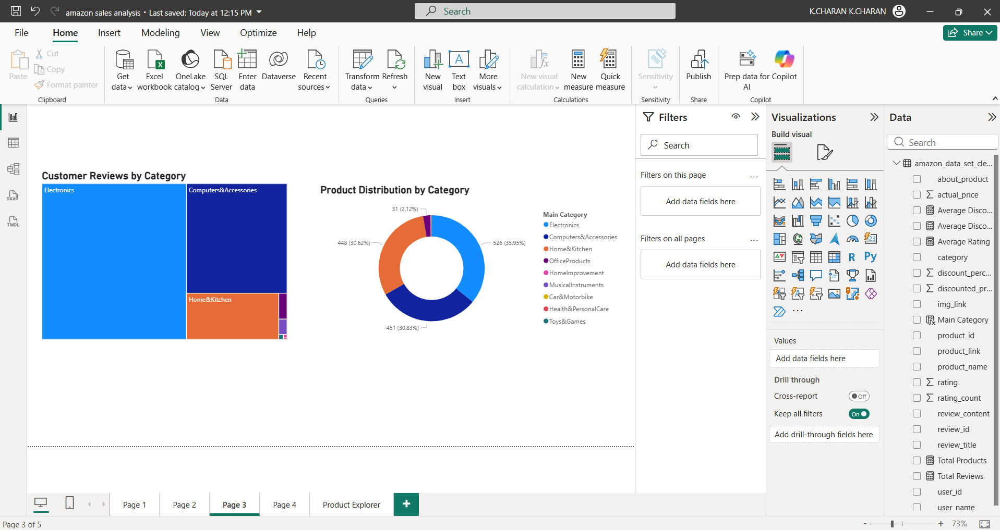
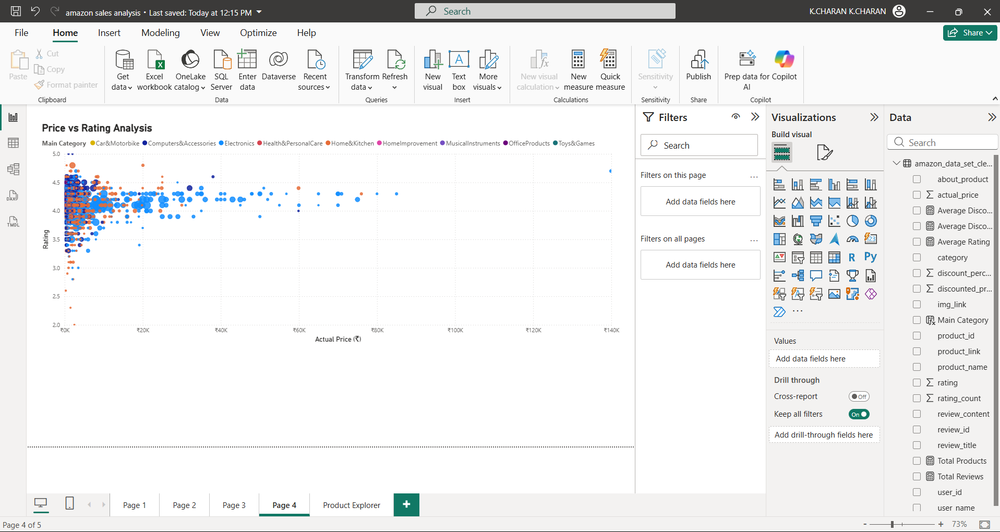
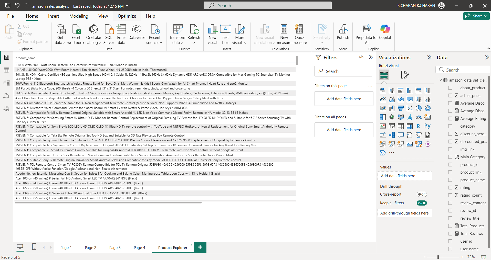

# 🛒 Amazon Product Analytics Dashboard

## 📌 Project Overview

This project is an interactive Power BI dashboard that analyzes Amazon product data to generate business insights on pricing, discounts, ratings, reviews, and category-wise performance. The dashboard helps users explore product trends through interactive visualizations and KPIs.

---

## 🎯 Objectives

- Analyze Amazon product pricing and discounts.
- Identify top-performing product categories.
- Compare customer ratings across categories.
- Explore customer review distribution.
- Study the relationship between product price and ratings.
- Provide an interactive Product Explorer for detailed analysis.

---

## Tools & Technologies

- Power BI
- Microsoft Excel / CSV
- DAX
- Power Query

---

## Dataset Information

**Dataset:** Amazon Product Dataset

**Key Columns**
- Product ID
- Product Name
- Main Category
- Actual Price
- Discounted Price
- Discount Percentage
- Rating
- Rating Count
- Review Count

---

## ✨ Dashboard Features

### KPI Cards
- Total Products
- Total Reviews
- Average Rating
- Average Discount
- Average Discounted Price

### Visualizations
- Products by Category
- Average Rating by Category
- Average Discount by Category
- Customer Reviews by Category
- Product Distribution by Category
- Price vs Rating Analysis
- Product Explorer

---

## 📊 Dashboard Pages

1. Overview Dashboard
2. Category Analysis
3. Customer Reviews
4. Price vs Rating Analysis
5. Product Explorer

---

# 🖼 Dashboard Preview

## 1. Overview Dashboard



---

## 2. Category Analysis



---

## 3. Customer Reviews



---

## 4. Price vs Rating Analysis



---

## 5. Product Explorer



---

## 📁 Repository Structure

```text
amazon-product-analytics-dashboard
│
├── Amazon Product Analytics Dashboard.pbix
├── Amazon_Dataset.csv
├── Amazon_Product_Analytics_Documentation.pdf
├── Dashboard_Home.png
├── Category_Analysis.png
├── Customer_Reviews.png
├── Price_vs_Rating.png
├── Product_Explorer.png
├── LICENSE
└── README.md
```

---

## 📂 Repository Contents

| File | Description |
|------|-------------|
| Amazon Product Analytics Dashboard.pbix | Power BI dashboard |
| Amazon_Dataset.csv | Dataset used for analysis |
| Amazon_Product_Analytics_Documentation.pdf | Complete project documentation |
| Dashboard_Home.png | Overview dashboard |
| Category_Analysis.png | Category analysis dashboard |
| Customer_Reviews.png | Customer reviews dashboard |
| Price_vs_Rating.png | Price vs Rating analysis |
| Product_Explorer.png | Product Explorer page |

---

## Business Insights

- Electronics contains the highest number of products.
- Categories offer varying average discounts.
- Higher-priced products generally maintain good customer ratings.
- Customer review volume differs significantly across categories.
- Interactive filters allow detailed product-level exploration.

---

## Future Improvements

- Sales and revenue analysis
- Time-series trend analysis
- Brand-wise performance dashboard
- Predictive analytics using Machine Learning

---

## 👨‍💻 Author

**Charan4488**

MBA – Business Analytics & Marketing

---

## License

This project is licensed under the MIT License.
